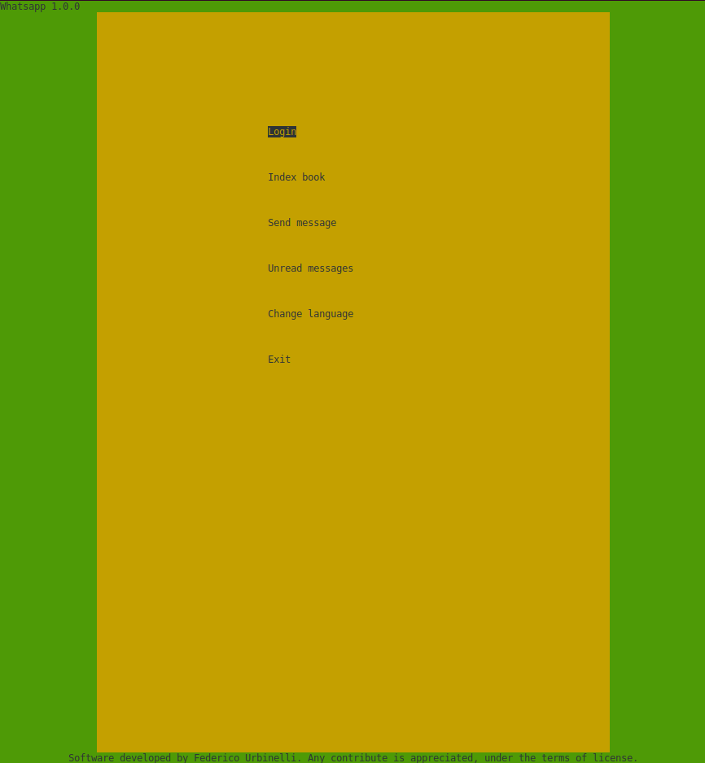
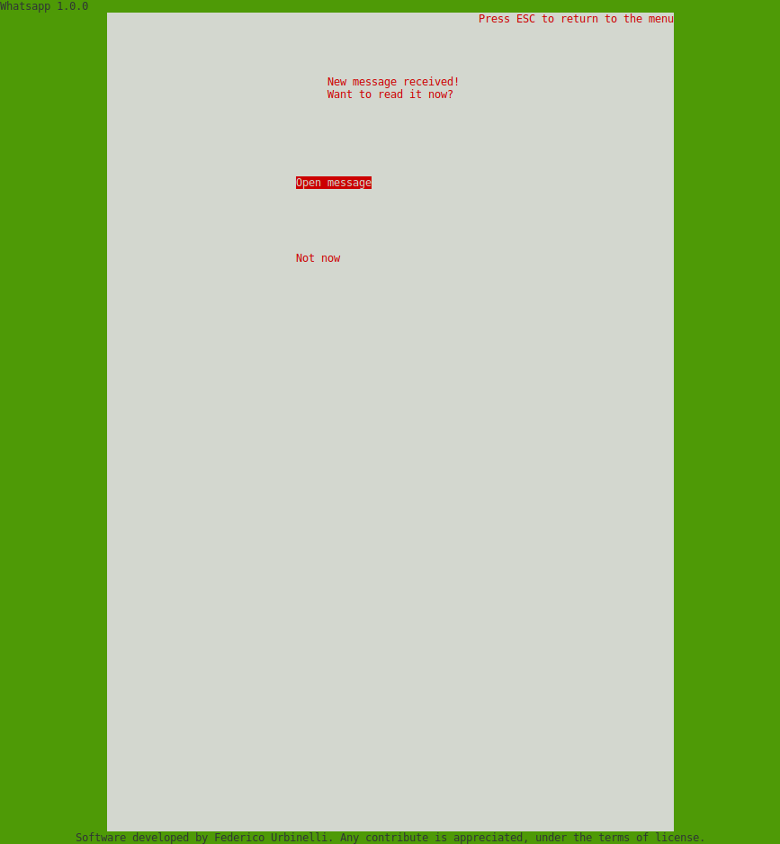

# Whatsapp
Client menu             |  Client receives a message
:-------------------------:|:-------------------------:
  |  

1. Little brief of this software
----------------------------------

Whatsapp is a pure C messaging application with the scope to guarantee multiuser and multilanguage support.
It's based in ncurses standard library and uses TCP connections.

The idea was born after the request of a simple school assignment --there wasn't mention of a server-client application, neither of a graphic user interface-- , which, day by day, I slowly reimagined, redesigned and finally realized.
The name of the project has always been "Whatsapp" since the small initial program, so I ended up to mantain this one.

I started developing this software in October 2016, and released it to the public domain in February 2017.

The key points of this software are:
- multi connections handling
- both server and client GUI
- possibility of dynamically change user
- possibility of dynamically add/remove user (client must reconnect)
- possibility of dynamically change language
- very low CPU cost since it's written in C

2.1. Getting the repository
---------------------------

```sh
$ sudo apt-get install git
$ git clone https://github.com/UrbiJr/Whatsapp.git
$ cd Whatsapp/
```
2.2. How to start
-----------------

First of all, download ncurses header files:
```sh
$ sudo apt-get update
$ sudo apt-get install ncurses-dev
```
SERVER:
> execute command `$ make`

> execute command `$ ./Whatsapp [PORT]` where PORT is your address port you want to use

CLIENT:
> execute command `$ make`

> execute command `$ ./Whatsapp [SERVADDR] [PORT]` where SERVADDR is the server address and PORT is its port

To restore the folders and delete object files: `$ make clean`


3. Contributing (for developers)
----------------------------------

Any contribute and improvement is well accepted.
Be free to improve the code, but please respect the style and the identation.
Current settings:
- indent mode: tabs
- indent size: 4

#### Documentation
About the documentation of the code with [Doxygen](https://en.wikipedia.org/wiki/Doxygen), just a few directives:
- each new function must be documented with at least the \brief, \param and \return tags;
- any further documentation of undocumented variables/structs is well accepted;
- it is suggested to use the Doxygen GUI frontend (Doxywizard) for a fastest generation of the documentation.

For any question about Doxygen, and how to generate the documentation, please refer to www.doxygen.org
N.B. A copy of the current documentation is provided with this repository.

4. Contact Information
------------------------

The maintainer of this project is Federico Urbinelli <federico.urbinelli@gmail.com>
